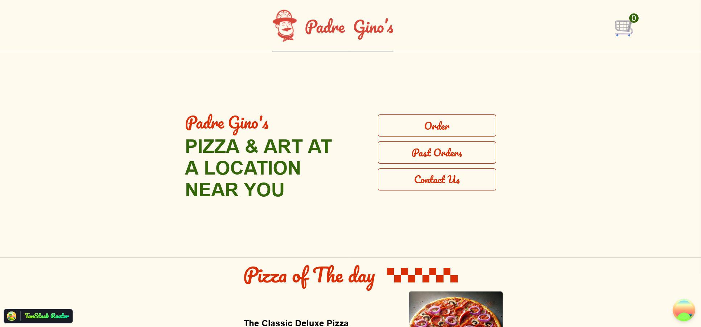
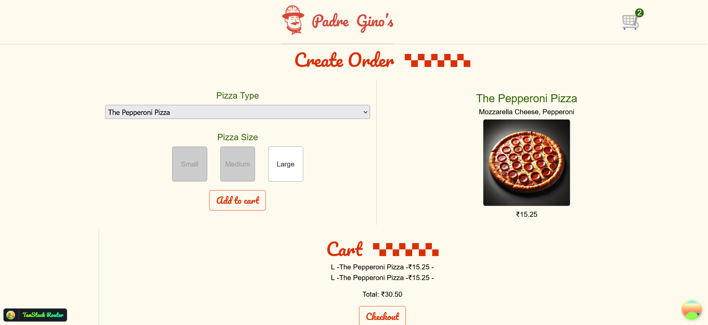
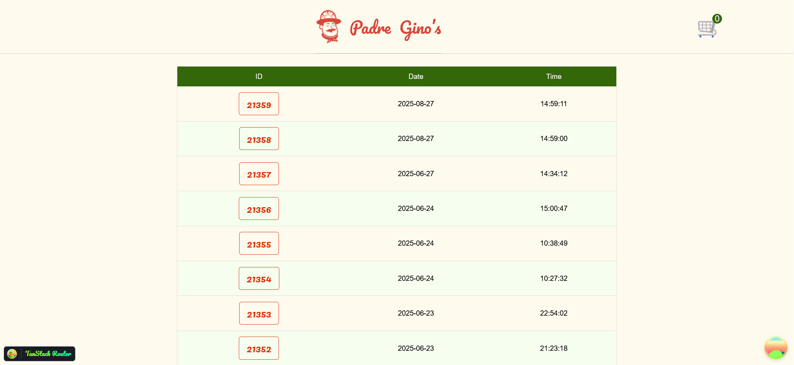
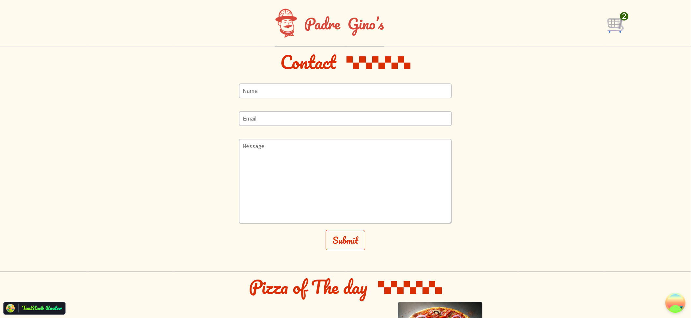
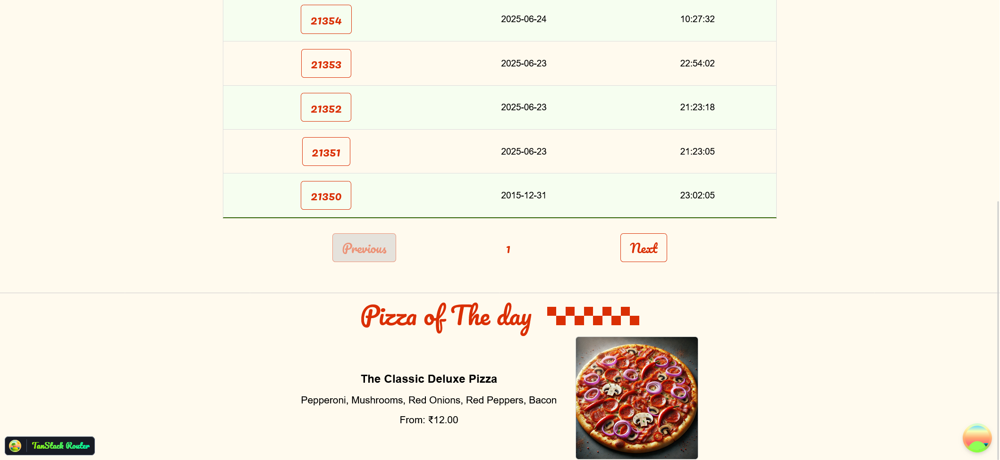
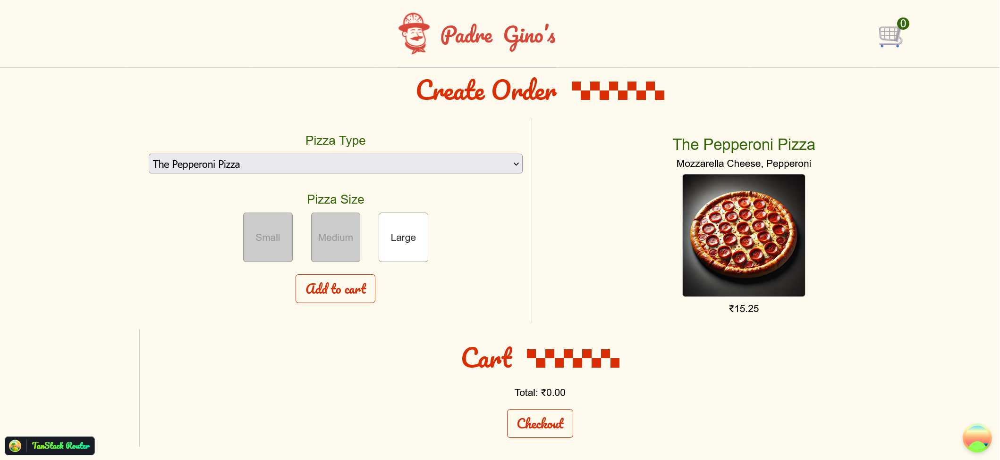

# Padre Gino's Pizza - Full-Stack Ordering App


This repository contains the source code for **Pizza of the Day**, a web application for ordering pizza online. It features a complete frontend built with React and a robust backend API powered by Node.js and Fastify.

---

## ✨ Application Screenshots

A quick look at the user interface of the application.

| Home Page                                     | Create Order Page                               |
| ------------------------------------------------------- | --------------------------------------------------------- |
|  |  |

| Past Orders                                   | Contact Us                                  |
| ------------------------------------------------------- | ----------------------------------------------------- |
|  |  |

| ------------------------------------------------------- | ----------------------------------------------------- |
|  |  |

---

## ⭐ Core Features

* **Dynamic Menu & Daily Specials**: Fetches a full list of available pizzas and features a unique "Pizza of the Day" that changes automatically every 24 hours.
* **Interactive Ordering System**: Users can select pizza types and sizes, see live price updates, and add items to a persistent shopping cart.
* **Seamless Checkout**: The cart can be submitted to the backend to create a new order in the database.
* **Order History**: Provides a paginated view of all past orders, allowing users to review their previous purchases.
* **Modern Frontend Stack**: Built with **React** and leverages **TanStack Router** for file-based routing and **TanStack Query** for efficient server state management and caching.
* **Robust UI**: Implements React **Error Boundaries** to gracefully handle rendering errors and prevent the entire application from crashing.

---

## 🛠️ Technology Stack

* **Runtime**: [Node.js](https://nodejs.org/)
* **Backend Framework**: [Fastify](https://www.fastify.io/)
* **Frontend Library**: [React](https://react.dev/)
* **Routing**: [TanStack Router](https://tanstack.com/router/)
* **Data Fetching**: [TanStack Query](https://tanstack.com/query/)
* **Database**: [SQLite](https://www.sqlite.org/index.html)
* **Styling**: Plain CSS with Custom Properties (Variables)

---

## 🚀 How To Run Locally

Follow these instructions to get a local copy of the project up and running for development.

### Prerequisites

* [Node.js](https://nodejs.org/) (v18 or later is recommended)
* NPM or another package manager

### Installation & Setup

1.  **Clone the repository:**
    ```bash
    git clone https://github.com/uttam-on-git/Pizza-of-the-Day
    cd Pizza-of-the-Day
    ```

2.  **Install project dependencies:**
    This command will install packages for both the backend and the React frontend.
    ```bash
    npm install
    ```

3.  **Prepare the database:**
    The server is configured to use a file named `pizza.sqlite` in the root directory. You may need to have a pre-existing database file with the correct schema for the application to function correctly.

### Running the Application

1.  **Start the backend server:**
    This will launch the Fastify API server.
    ```bash
    node server.js
    ```
    The API will be available at `http://localhost:3000`.

2.  **Start the frontend development server:**
    Open a new terminal and run the following command to start the React app.
    ```bash
    # (Assuming a standard React setup like Vite)
    npm run dev
    ```
    The application frontend will be accessible in your browser, typically at `http://localhost:5173`.

---

## ⚙️ API Endpoints

The backend server provides the following public API endpoints.

| Method | Route                       | Description                                                         |
| :----- | :-------------------------- | :------------------------------------------------------------------ |
| `GET`  | `/api/pizzas`               | Retrieves a list of all available pizza types with sizes and prices. |
| `GET`  | `/api/pizza-of-the-day`     | Returns the details for the daily special pizza.                     |
| `POST` | `/api/order`                | Creates a new order in the database from the submitted cart data.    |
| `GET`  | `/api/past-orders`          | Fetches a paginated list of all historical orders.                   |
| `GET`  | `/api/past-order/:order_id` | Retrieves the complete details for a single specified order.           |
| `POST` | `/api/contact`              | Receives and logs a message from the contact form.                   |
